# Voiceover Generation Workflow

## Visual Flowchart

```mermaid
flowchart TD
    subgraph INPUT["📥 INPUT"]
        A[CSV/Excel Upload] --> B[Parse & Validate]
        B --> C{Valid?}
        C -->|No| D[❌ Show Errors]
        C -->|Yes| E[Create Batch]
    end

    subgraph GENERATION["🎙️ GENERATION LOOP"]
        E --> F[For Each Row]
        F --> G[Resolve Voice ID]
        G --> H[Generate Audio<br/>via ElevenLabs]
        H --> I[Trim Silence<br/>from Start/End]
        I --> J[Measure Duration]
    end

    subgraph TIMING["⏱️ TIMING CHECK"]
        J --> K{Within ±0.3s<br/>of Target?}
        K -->|No| L{Retries<br/>Left?}
        L -->|Yes| M[Adjust Speed<br/>0.7x - 1.2x]
        M --> N[Add Audio Tags<br/>slower/faster]
        N --> H
        L -->|No| O[Use Best Attempt]
        K -->|Yes| P[Proceed to QC]
        O --> P
    end

    subgraph QC["🔍 QUALITY CONTROL"]
        P --> Q[Audio QC<br/>Clipping/Silence/Distortion]
        Q --> R[Whisper Transcription]
        R --> S[LLM Text QC<br/>Compare Script vs Transcript]
        S --> T[Gemini Audio QC<br/>Tone/Pacing/Delivery]
    end

    subgraph AUDIOQC_RETRY["🔄 AUDIO QC RETRY"]
        T --> U{Audio QC<br/>Passed?}
        U -->|Fail + Has Tags| V{Retries<br/>Left?}
        V -->|Yes| W[Add Suggested Tags<br/>excited/professional/etc]
        W --> H
        V -->|No| X[Continue to Status]
        U -->|Pass/Flag| X
    end

    subgraph OUTPUT["📤 OUTPUT"]
        X --> Y{Final Status}
        Y -->|All QC Pass| Z[✅ completed/]
        Y -->|QC Issues| AA[⚠️ needs_review/]
        Y -->|Failed| AB[❌ failed/]
        Z --> AC[Generate Report<br/>CSV + JSON]
        AA --> AC
        AB --> AC
    end

    style A fill:#e1f5fe
    style Z fill:#c8e6c9
    style AA fill:#fff3e0
    style AB fill:#ffcdd2
    style H fill:#e8eaf6
    style T fill:#fce4ec
    style S fill:#f3e5f5
```



## Step-by-Step Breakdown

### 1️⃣ Input Processing
| Step | Description |
|------|-------------|
| Upload | User submits CSV/Excel file |
| Parse | Extract script_text, target_duration, voice_id, etc. |
| Validate | Check required columns, data types, value ranges |

### 2️⃣ Audio Generation
| Step | Description |
|------|-------------|
| Resolve Voice | Look up voice ID from name if needed |
| Generate | Call ElevenLabs API with script + voice settings |
| Trim Silence | Remove leading/trailing silence (keep 75ms padding) |
| Measure | Get actual duration of trimmed audio |

### 3️⃣ Timing Adjustment Loop
| Step | Description |
|------|-------------|
| Check | Is duration within ±0.3s of target? |
| Adjust | Calculate new speed (0.7x - 1.2x range) |
| Retry | Regenerate with adjusted speed + audio tags |
| Max 5 | Up to 5 attempts, keeps best result |

### 4️⃣ Quality Control Pipeline
| Check | Tool | What It Does |
|-------|------|--------------|
| Audio QC | PyDub | Clipping, silence ratio, distortion (ZCR) |
| Transcription | Whisper | Convert audio back to text |
| Text QC | Claude | Compare transcript to original script |
| Audio QC | Gemini | Analyze tone, pacing, delivery, artifacts |

### 5️⃣ Audio QC Retry (New!)
| Step | Description |
|------|-------------|
| Check Result | Did Gemini Audio QC fail? |
| Get Tags | Extract suggested tags (e.g., "excited, slower") |
| Retry | Regenerate with those audio tags prepended |

### 6️⃣ Output Organization
| Folder | Condition |
|--------|-----------|
| `completed/` | All QC checks passed |
| `needs_review/` | QC flagged issues for human review |
| `failed/` | Generation failed completely |

---

## Audio Tags Reference

ElevenLabs V3 supports these tags that can be prepended to scripts:

| Category | Tags |
|----------|------|
| **Emotion** | `[excited]` `[happy]` `[sad]` `[angry]` `[calm]` `[serious]` |
| **Style** | `[professional]` `[conversational]` `[narrative]` `[friendly]` `[authoritative]` |
| **Pacing** | `[slower]` `[faster]` |
| **Other** | `[whisper]` |

---

## Example Flow

```
Input: "Call 1-800-555-1234 today!" (target: 5.0s)
                    ↓
        Generate at speed 1.0x
                    ↓
        Result: 3.2s (too short!)
                    ↓
        Adjust: speed = 1.0 × (3.2/5.0) = 0.64 → clamped to 0.7x
                    ↓
        Retry with [slower] tag at 0.7x speed
                    ↓
        Result: 4.8s ✓ (within tolerance)
                    ↓
        Run QC checks...
                    ↓
        Gemini: "Sounds robotic" → suggests [friendly, conversational]
                    ↓
        Retry with [slower] [friendly] [conversational] tags
                    ↓
        Result: 4.9s ✓ + QC Pass ✓
                    ↓
        Save to completed/
```
